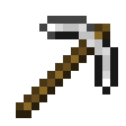

#  AkuManusiaaWeb

Selamat datang di website ini! Website ini hanya berisi percobaan 

<h2> <a href="cerita/">Cerita</a></h2>
Cerita yang sangat menginspirasi. 
 <a href="cerita/lorem"><i>Lorem Ipsum</i></a> - Cerita dari bangsa Romawi. 
 <a href="cerita/kantor">Cerita Kantor</a> - Cerita pekerja keras di kantor.

<h2> <a href="addon">Add-on Minecraft</a></h2>
Add-on Minecraft yang saya buat sebagai add-on Minecraft.

  

`Lorem ipsum dolor sit amet.`